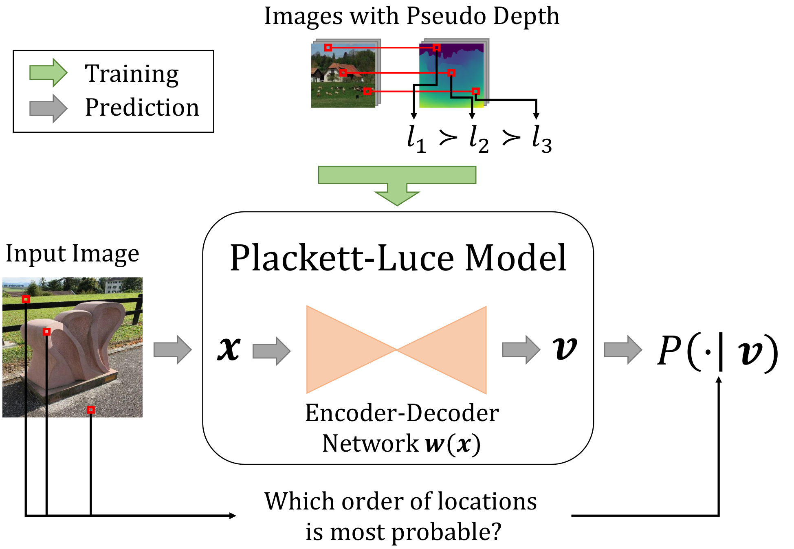

# Monocular Depth Estimation via Listwise Ranking using the Plackett-Luce Model

A Tensorflow 2.* implementation of the **Plackett-Luce model for monocular depth ranking** as presented at CVPR 2021.



Please cite this work as follows:

```
@InProceedings{Lienen_2021_CVPR,
    author    = {Lienen, Julian and H\"ullermeier, Eyke and Ewerth, Ralph and Nommensen, Nils},
    title     = {Monocular Depth Estimation via Listwise Ranking Using the Plackett-Luce Model},
    booktitle = {Proceedings of the IEEE/CVF Conference on Computer Vision and Pattern Recognition (CVPR)},
    month     = {June},
    year      = {2021},
    pages     = {14595-14604}
}
```

## Requirements

A detailed list of requirements can be found in `requirements.txt`. To install all required packages (we recommend to create a virtual environment), one simply has to call
```
pip install -r requirements.txt
```

Note that the code has been tested with Python 3.8 on Ubuntu 20.04. Since we tried to avoid using any system-dependent call or library, we expect the code to be running also on other systems, such as Windows and MacOS. Possibly, path delimiters must be changed to run on non-unixoid systems.

In some cases, we've experienced issues with the MySQL adapter package for Python 3.* (used to store experimental results using [Mlflow](https://mlflow.org/)), for which the pip package install was not sufficient to run the code. On Linux systems, this package may require to install additional system-dependent sources (e.g., for Ubuntu, we also had to run `sudo apt install build-essential python-dev libmysqlclient-dev`).

## Repository Structure

This repository provides our PLDepth{Eff,Res}Net training implementation, together with the code used for evaluation. The following list gives a more detailed overview over the individual packages that this repository contains:

- `pldepth.data` provides data access objects, implementations to retrieve rankings from depth data and more I/O related code.
- `pldepth.losses` provides the implementation of the used ListMLE loss function.
- `pldepth.models` includes the regarded model architectures, namely the ResNet- and EfficientNet-based models.
- `pldepth.util` contains utility functions used throughout the project.

A basic configuration file is given by `conf/run.ini`. Here, Mlflow parameters, logging settings and data paths for each dataset can be specified. Its worth to note that the `CACHE_PATH_PREFIX` specifies a location to which all intermediate results should be stored. As will be described later in the evaluation section, this directory also serves as entry point for the predictions of external baseline predictions, which are used for the final result calculation.

## Model Training

The repository's entry point is `pldepth.PLDepth.py`, which can be run in order to train a PL model for depth estimation. For our implementation, we used [Click](https://click.palletsprojects.com/en/7.x/) to provide a convenient CLI for passing parameters. Therefore, you can print out all possible program arguments with the `--help` parameter.

As an example, the following command trains a Plackett-Luce model for depth estimation based on the proposed EfficientNet-based architecture (similar to the one used within our evaluation):

```
python3 pldepth/PLDepth.py --model_name ff_effnet --ranking_size 5 --initial_lr 0.0001 --seed 0
```

## References

[1] Ranftl, René, et al. "Towards robust monocular depth estimation: Mixing datasets for zero-shot cross-dataset transfer." IEEE Transactions on Pattern Analysis and Machine Intelligence (2020).
